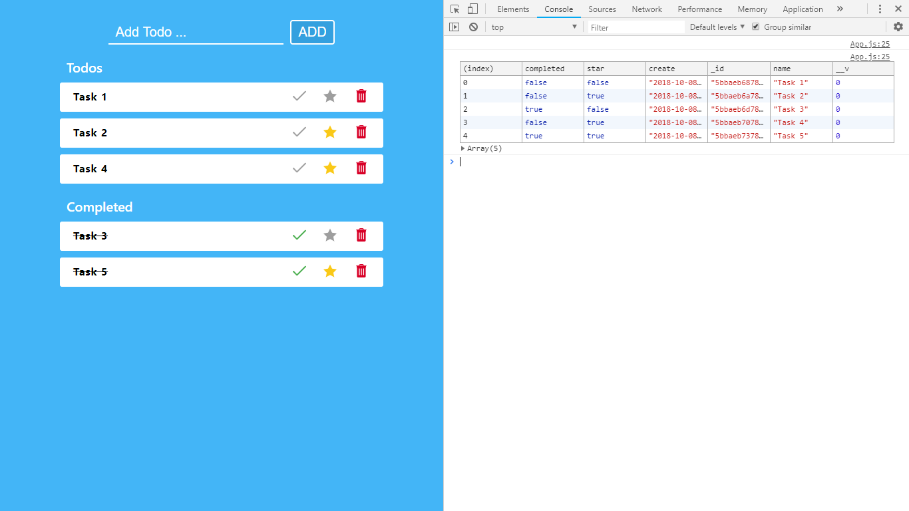
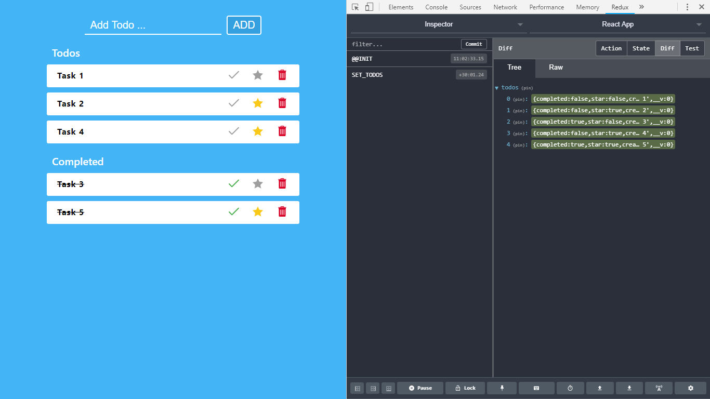

<h1 align="center">
   ⭐ ToDo Web app with MERN stack ⭐ 
</h1>

  <!-- Licence -->
    
  <!-- NODE Version -->
    
  <!-- NPM Version -->
    
  <!-- React Version -->
    
  <!-- Build -->
    

<h4 align="center">
  Built with ❤︎ by
  <a href="https://github.com/reactuserakash">Akash Debnath</a>
</h4>
  
This web app is made with MERN stack. It combines React, Dudux, Node, Expsess, MongoDB.
Fork and contribute in this if you wish. Just change the db path in package.json file 

<h3>Console view</h3>

  

<h3>Redux view</h3>

  

.
